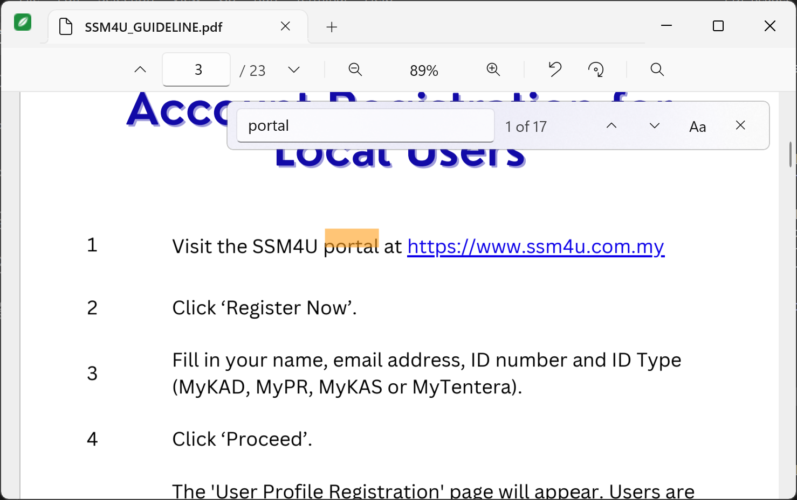
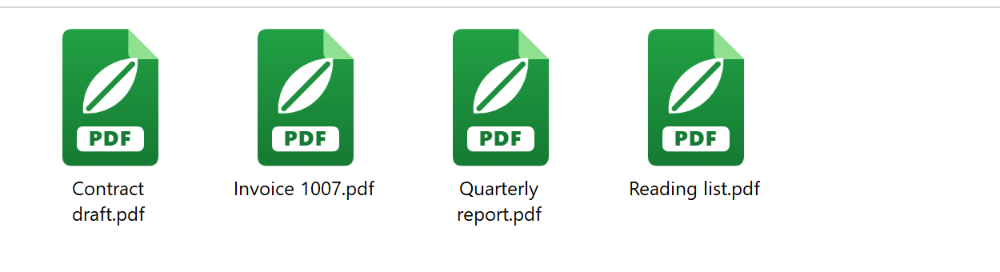

<p align="center">
  
</p>

<h1 align="center">Leaf</h1>

<p align="center"><strong>A light, fast PDF reader for Windows 11.</strong><br>
Native C# / .NET 10 + WinUI 3, rendering with PDFium, compiled ahead of time, one small process.</p>

<p align="center">
  <a href="https://github.com/reduan8087/Leaf/releases/latest/download/Leaf-Setup-x64.exe"><strong>⬇ Download Leaf-Setup-x64.exe</strong></a>
  &nbsp;·&nbsp; <a href="https://github.com/reduan8087/Leaf/releases">All releases</a>
  &nbsp;·&nbsp; 18.6 MB, Windows 11 (or Windows 10 2004+), x64, no admin needed
</p>

<p align="center">
  
  
  
</p>



## Why Leaf

Adobe Acrobat spawns nine processes and over half a gigabyte of memory to show a 60-page document, and takes almost three seconds to open it. Leaf opens the same file in a quarter of a second in one process, with tabs, find, and text selection, and installs without administrator rights or any runtime prerequisites.

Measured on the same 60-page PDF, same laptop (Core i7-11800H, Windows 11 25H2), warm start, median of 3 runs:

| | Leaf 0.1.2 | Adobe Acrobat 26 |
|---|---|---|
| Time until the window is up | **0.21 s** | 2.9 s |
| Time until the first page is painted | **0.44 s** | – |
| Processes | **1** | 9 |
| Memory (working set, document open) | **~210 MB** | 541 MB (all processes) |
| Memory shown in Task Manager | **~140 MB** | ~250 MB (all processes) |
| Installed size | **76 MB** | ~2.6 GB |

Full numbers and how they were measured: [docs/PERF.md](docs/PERF.md).

## Features

- **Opens everything the way you expect:** double-click in Explorer, drag a file onto the window, `Ctrl+O`, or the command line. Each document is a tab in one window; a second launch just adds a tab.
- **Reading:** continuous scrolling, fit width / fit page / 10–800 % zoom (Ctrl + mouse wheel, `Ctrl+=` / `Ctrl+-`, `Ctrl+0`), rotation, page box with `Ctrl+G`, keyboard navigation.
- **Find:** `Ctrl+F` with live "n of m" count, `F3` / `Shift+F3`, match case, highlights on the page.
- **Text:** select by dragging (across pages too), double-click a word, `Ctrl+A` for the page, `Ctrl+C` to copy.
- **Robust:** password-protected PDFs, form fields rendered, damaged files reported instead of crashing, and Leaf never locks your file: if something else saves it, Leaf offers to reload.
- **Native look:** Mica title bar, tabs in the title bar, light and dark theme follow Windows, crisp rendering at any display scaling.
- **Own icons for PDFs:** bold green document icons in Explorer, at every size from 16 to 256 px.



## Install

1. Download [`Leaf-Setup-x64.exe`](https://github.com/reduan8087/Leaf/releases/latest/download/Leaf-Setup-x64.exe) and run it. It installs per user (no UAC prompt) into `%LOCALAPPDATA%\Programs\Leaf`.
2. The setup is not code-signed yet, so SmartScreen shows a warning the first time: click **More info**, then **Run anyway**.
3. On the last page, keep "Open Windows Settings so I can make Leaf the default PDF app" ticked and press **Set default** on the Settings page that opens. (Windows 11 only lets you, not the installer, make that final choice.) You can do this later from Leaf's menu (the leaf icon at the top left) or from the prompt Leaf shows when it is not yet the default.

To uninstall, use Settings > Apps > Leaf. Nothing else on the system is touched: no services, no background updaters, no browser plug-ins.

## Keyboard shortcuts

| Action | Keys |
|---|---|
| Open file / close tab / switch tab | `Ctrl+O` / `Ctrl+W` / `Ctrl+Tab`, `Ctrl+Shift+Tab` |
| Zoom in / out / fit width | `Ctrl+=` or `Ctrl++` / `Ctrl+-` / `Ctrl+0`, or `Ctrl` + mouse wheel |
| Fit page, presets | zoom menu in the toolbar (click the percentage) |
| Rotate right / left | `Ctrl+Shift+R` / `Ctrl+Shift+L` |
| Go to page | `Ctrl+G`, then type the number and press `Enter` |
| Scroll | `Page Down` / `Page Up` / `Space` / `Shift+Space` / arrow keys / `Home` / `End` |
| Find / next / previous | `Ctrl+F` / `F3` or `Enter` / `Shift+F3` or `Shift+Enter` |
| Select all text on the page / copy | `Ctrl+A` / `Ctrl+C` |
| Close find bar or clear selection | `Esc` |

## How it works

- **Engine:** [PDFium](https://pdfium.googlesource.com/pdfium/) (the renderer inside Chrome), called directly through a small set of hand-written `[LibraryImport]` bindings. No managed wrapper library. All PDFium calls run on one dedicated thread with a priority queue, because PDFium is not thread-safe.
- **Rendering:** pages are drawn as 1024 px tiles at the exact device pixel size, so text is crisp at 125 % or 200 % scaling and memory is bounded by the screen rather than by the zoom level. Zooming scales the current tiles on the GPU instantly, then re-renders crisp tiles 150 ms later.
- **Text:** when a page is on screen its character boxes are fetched once, so hit-testing, selection and search highlights never wait for the engine.
- **UI:** WinUI 3 on the Windows App SDK, unpackaged and self-contained, published as a Native AOT executable (`Leaf.exe` is ~8 MB and starts without a JIT).
- **Single instance:** a second `Leaf.exe` forwards its command line to the running window and exits before any UI is created, in about 50 ms.

Details: [docs/ARCHITECTURE.md](docs/ARCHITECTURE.md) · design decisions and their reasons: [docs/DECISIONS.md](docs/DECISIONS.md).

## Build from source

Requirements: Windows 11, [.NET 10 SDK](https://dotnet.microsoft.com/download), Visual Studio 2022 Build Tools with the "Desktop development with C++" workload (the Native AOT linker needs MSVC), and [Inno Setup 6](https://jrsoftware.org/isinfo.php) for the installer (`winget install --id JRSoftware.InnoSetup --exact --scope user`).

```powershell
git clone https://github.com/reduan8087/Leaf.git
cd Leaf
dotnet build Leaf.slnx -c Debug -p:Platform=x64                       # debug build
dotnet run --project src/Leaf -c Debug -p:Platform=x64 -- "file.pdf"  # run it
dotnet test tests/Leaf.Pdfium.Tests -c Release                         # engine tests
pwsh -File scripts/publish.ps1                                         # Native AOT publish -> artifacts/publish
pwsh -File scripts/make-installer.ps1                                  # + Inno Setup -> dist/Leaf-Setup-x64.exe
```

Useful scripts:

| Script | Purpose |
|---|---|
| `scripts/publish.ps1` | Native AOT publish. Also works on machines without the Windows SDK import libraries (it fetches them from Microsoft's NuGet package). |
| `scripts/make-installer.ps1` | Publish + compile `installer/Leaf.iss`. |
| `scripts/make-icons.ps1` | Regenerates both `.ico` files from the vector artwork at every size. |
| `scripts/soak.ps1` | Stability test: opens a PDF, resizes, scrolls, zooms, minimizes; fails if the process exits. |
| `scripts/measure-perf.ps1` | Startup and memory table, optionally compared with Acrobat. |
| `scripts/screenshot.ps1` | Launches Leaf on a PDF, runs scripted actions, captures the window. |

Testing: 14 engine tests run against PDFs generated on the fly (multi-size and rotated pages, RC4-encrypted, corrupt input, non-ASCII paths). Set `LEAF_CORPUS_DIR` to a folder to sweep every PDF in it; the 1,749 PDFs on the development laptop all open and render.

## Project layout

```
src/Leaf.Pdfium/    PDFium bindings, engine thread, document/text/search (no UI dependencies)
src/Leaf/           WinUI 3 app: window, tabs, viewer, tile cache, find, selection, services
tests/              xunit tests with generated fixture PDFs
installer/          Inno Setup script (file association, Default Apps registration)
scripts/            build, publish, installer, icons, perf and soak scripts
docs/               architecture, decisions, performance log, MVP scope
```

## Roadmap

Planned for v0.2: print, bookmarks/outline pane, page thumbnails, clickable links, remember the last page per file, recent files, GPU-only tiles (lower idle memory), code signing.

Not planned: XFA forms and PDF JavaScript (they would need the much larger V8 build of PDFium), editing.

## Versions

| Version | Date | Notes |
|---|---|---|
| 0.1.2 | 2026-09-04 | New icons: green PDF document icon and leaf app tile. |
| 0.1.1 | 2026-09-04 | Fixed a crash 10–30 s after a resize or on scroll (WinUI bitmap lifetime). Faster startup. |
| 0.1.0 | 2026-09-04 | First MVP: tabs, viewing, find, selection, installer. |

## Third-party

- PDFium — Apache License 2.0, binaries from [bblanchon/pdfium-binaries](https://github.com/bblanchon/pdfium-binaries).
- Windows App SDK / WinUI 3 — Microsoft Software License Terms.
- .NET — MIT.

See [docs/THIRD-PARTY-NOTICES.md](docs/THIRD-PARTY-NOTICES.md).

## License

MIT — see [LICENSE](LICENSE).
